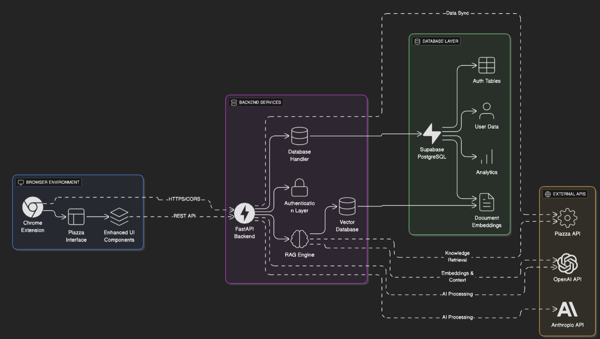

# Piazza AI Plugin 🧠

AI-powered browser extension that enhances the Piazza experience with intelligent features for students and instructors.

## 🏗️ Righ High-Level Architecture



## 📁 Project Structure

```
Piazza-AI-Plugin/
├── 🌐 frontend/              # Chrome Extension
│   ├── manifest.json         # Extension configuration
│   ├── content/              # Content scripts (Piazza integration)
│   ├── popup/                # Extension popup UI
│   └── background/           # Service worker
├── ⚙️ backend/               # FastAPI Backend
│   ├── app/
│   │   ├── api/              # API endpoints
│   │   ├── core/             # Core functionality (config, database)
│   │   └── models/           # Data models
│   ├── main.py               # FastAPI application
│   └── requirements.txt      # Python dependencies
├── 🗄️ supabase/             # Database & Auth
│   ├── migrations/           # Database schema changes
│   ├── functions/            # Edge functions
│   └── config.toml           # Supabase configuration
└── 🔧 .github/workflows/     # CI/CD pipelines
```

## 🔄 Data Flow

1. **User Interaction**: User interacts with enhanced Piazza interface through the Chrome extension
2. **Content Processing**: Extension captures and processes Piazza content
3. **API Communication**: Extension sends requests to FastAPI backend via CORS-enabled endpoints
4. **Knowledge Retrieval**: RAG engine searches vector database for relevant context and documents
5. **AI Processing**: Backend combines retrieved context with user queries for enhanced AI responses
6. **Embedding Generation**: New content is processed into embeddings and stored for future retrieval
7. **Database Operations**: User data, analytics, embeddings, and AI responses stored in Supabase
8. **Real-time Updates**: Live updates pushed back to extension via WebSocket/polling

## 🚀 Key Features

- **🤖 AI-Powered Assistance**: Intelligent responses and content analysis
- **📊 Analytics Dashboard**: Usage patterns and learning insights
- **🔐 Secure Authentication**: Supabase-based user management
- **🌐 Real-time Sync**: Live updates across devices and sessions
- **🎨 Enhanced UI/UX**: Seamless integration with Piazza's interface
- **📱 Cross-Platform**: Works across different browsers and devices

## 🛠️ Technology Stack

| Component       | Technology            | Purpose                     |
| --------------- | --------------------- | --------------------------- |
| **Frontend**    | Chrome Extension APIs | Browser integration & UI    |
| **Backend**     | FastAPI + Python      | REST API & business logic   |
| **Database**    | Supabase (PostgreSQL) | Data persistence & auth     |
| **AI Services** | OpenAI + Anthropic    | Natural language processing |
| **DevOps**      | GitHub Actions        | CI/CD & automated testing   |
| **Monitoring**  | Supabase Analytics    | Usage tracking & insights   |

## 🎯 Team Structure

- **👨‍💻 10 Developers**: Full-stack development (frontend + backend)
- **🔧 2 Technical Leads**: Architecture oversight & code review
- **🎨 2 Designers**: UI/UX design & user experience

## ⚡ Quick Start

### Prerequisites

- [Chrome Browser](https://www.google.com/chrome/) (for extension development)
- [Python](https://python.org/) (v3.11+)
- [Supabase CLI](https://supabase.com/docs/guides/cli) (for database)

### 🚀 Setup Instructions

Follow these guides in order for complete setup:

1. **📁 [Backend Setup Guide](./backend/README.md)**

   - FastAPI server configuration
   - Environment variables setup
   - Database connection

2. **🗄️ [Supabase Database Guide](./supabase/README.md)**

   - Local database setup
   - Schema initialization
   - CLI configuration

3. **🌐 [Frontend Chrome Extension Guide](./frontend/README.md)**
   - Extension development setup
   - Environment configuration
   - Loading in Chrome Developer Mode

### ⚡ Quick Development Start

```bash
# 1. Clone repository
git clone https://github.com/ubclaunchpad/Piazza-AI-Plugin.git
cd Piazza-AI-Plugin

# 2. Setup backend (see backend/README.md for details)
cd backend && pip install -r requirements.txt
touch .env  # Add your environment variables
python main.py

# 3. Setup database (see supabase/README.md for details)
cd ../supabase && supabase start

# 4. Setup frontend (see frontend/README.md for details)
cd ../frontend && ./build.sh
# Load build/ folder in Chrome Developer Mode
```

## 📚 Documentation

### Setup Guides

- **[🌐 Frontend Chrome Extension](./frontend/README.md)** - Extension development, environment setup, and Chrome loading
- **[⚙️ Backend FastAPI Server](./backend/README.md)** - API server configuration, dependencies, and environment setup
- **[🗄️ Supabase Database](./supabase/README.md)** - Database setup, migrations, and local development

### Development Resources

- **[API Documentation](http://localhost:8000/docs)** - Interactive API docs (when backend is running)
- **[Architecture Overview](#-data-flow)** - System design and component interaction
- **[Contributing Guidelines](#-contributing)** - Development workflow and standards

## 🔧 Development Workflow

1. **Create Feature Branch**: `git checkout -b feature/your-feature-name`
2. **Make Changes**: Implement your feature with proper testing
3. **Run Tests**: `npm test` (frontend) + `pytest` (backend)
4. **Commit**: Follow conventional commit format
5. **Push & PR**: Create pull request for review
6. **Code Review**: Requires approval from technical leads
7. **Merge**: Squash and merge to main branch

## 🚀 Deployment

- **Backend**: Automatic deployment via GitHub Actions
- **Database**: Migrations applied via Supabase CLI
- **Extension**: Built and packaged for Chrome Web Store

## 🤝 Contributing

1. Check [Issues](https://github.com/ubclaunchpad/Piazza-AI-Plugin/issues) for available tasks
2. Follow the development workflow above
3. Ensure code follows project style guidelines
4. Add tests for new functionality
5. Update documentation as needed

## 📄 License

This project is licensed under the MIT License - see the [LICENSE](LICENSE) file for details.

---

**Built by [UBC Launch Pad](https://ubclaunchpad.ca/)**
